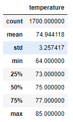
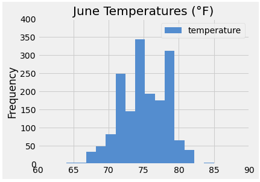
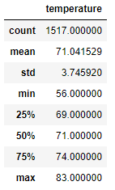
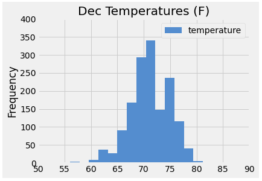

# surfs_up

## Overview

The main objective of this module (**Module 09: Advanced Data Storage and Retrieval**) is to get familiar with *SQLite*, *SQLAlchemy* and *Flask*.

*SQLite* is a version of SQL database engine that is lighter and faster and that it is stored and run locally in a single user computer or phone.

*SQLAlchemy* is a query tool for SQLite with integrated statistical analysis and compatibility with Python and Python Pandas library.

*Flask* is a web framework that uses Python to build web pages, ideal to showcase our analysis results with anyone else.

The activity consist in conducting an analysis of the weather conditions, specifically, the historic temperatures during the  months of June and December to help assess the viability of opening a Surf n' Shake Shop in a joint venture on the Oahu island, Hawaii.

## Resources

### Datasets

* **[Input Database](./hawaii.sqlite)**.
* **[Code](./SurfsUp_Challenge.ipynb)**

### Software

* *Jupyter Notebook v6.4.8*
* *Python v3.10*
* *SQLite v3.39.4*
* *SQLAlchemy v1.4*
* *Matplotlib v3.6.0*
* *Pandas v1.5*

## Results

Three final deliverables are provided as a result of the analysis:

1. **[Deliverable 1: Summary Statistics for June](./Resources/summary_june.png)**. Contains statistical information derived from the analysis of the daily temperatures during the month of June in the years 2010 to 2017.

2. **[Deliverable 2: Summary Statistics for December](./Resources/summary_december.png)**. Contains statistical information derived from the analysis of the daily temperatures during the month of December in the years 2010 to 2016.

3. **Deliverable 3: A written analysis (this README.md file)**.

The results indicate that the temperature is realtively similar between June and December, which suggest that the temperature is stable throughout the year in Oahu.

*Image 01: Temperature Summary Statistics for June.*

*Image 02: Temperature Plot for June.*

While the mean, standard deviation and maximum temperature values of the months of June and December are similar, there is a bit wider but expected difference in the minimum temperature. It is also worth noticing that the count of temperature values is slightly larger for the month of June that for December, this is because the last day analyzed is August 23rd of 2017.

*Image 03: Temperature Summary Statistics for December.*

*Image 04: Temperature Plot for December.*

## Summary

The results of the analysis indicate that the temperature in Oahu is stable throughout the year. While this is a positive indication for opening a Surf n' Shake Shop in the island, there are other important analysis that can be conducted:

* An analysis of the precipitation for the months of June and December is critical before coming with a resolution about our business.
* Mapping the location of the weather stations and identifying their proximity to the Surf n' Shake Shop is important to have a clearer understanding of the impact of the weather conditions in our local business. For this matter, the latitude and longituide can be query from the Stations table.